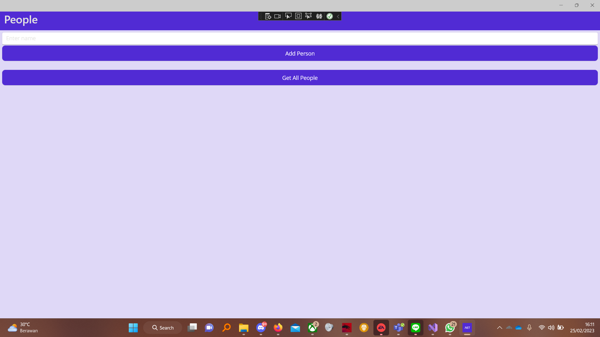
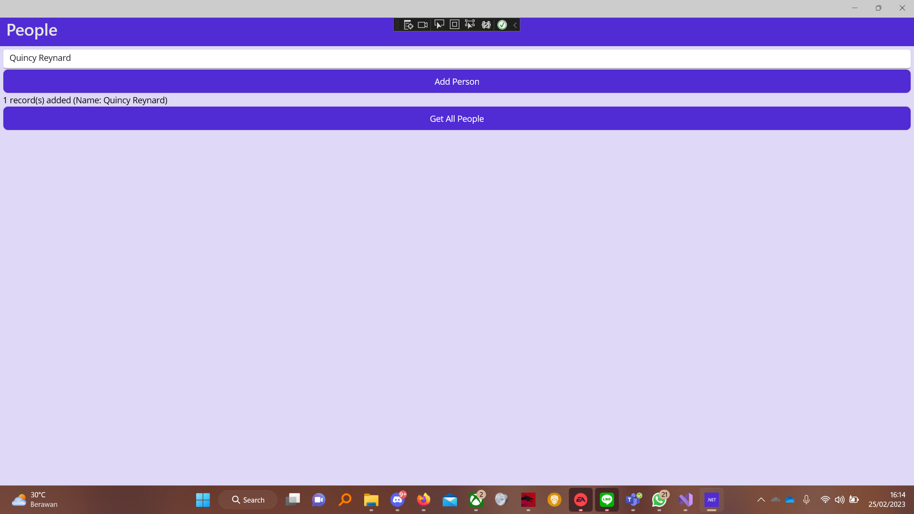
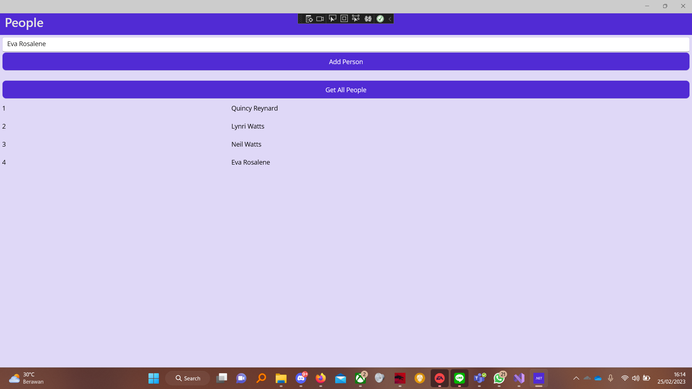
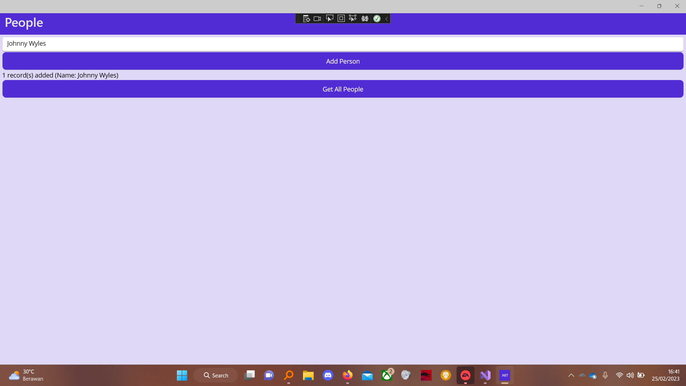
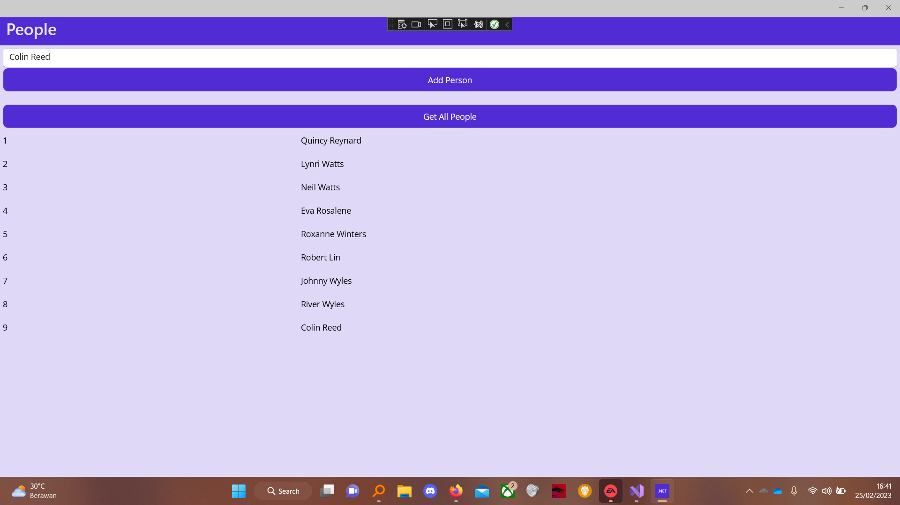

- [Table of Contents](#people)
  * [Synchronous Database](#synchronous-database)
    + [Base Look](#base-look)
    + [Add Person](#add-person)
    + [Get All People](#get-all-people)
  * [Asynchronous](#asynchronous)
    + [Add Person](#add-person-1)
    + [Get All People](#get-all-people-1)

# People

## Synchronous Database

### Base Look

### Add Person

### Get All People

## Asynchronous

### Add Person

### Get All People

